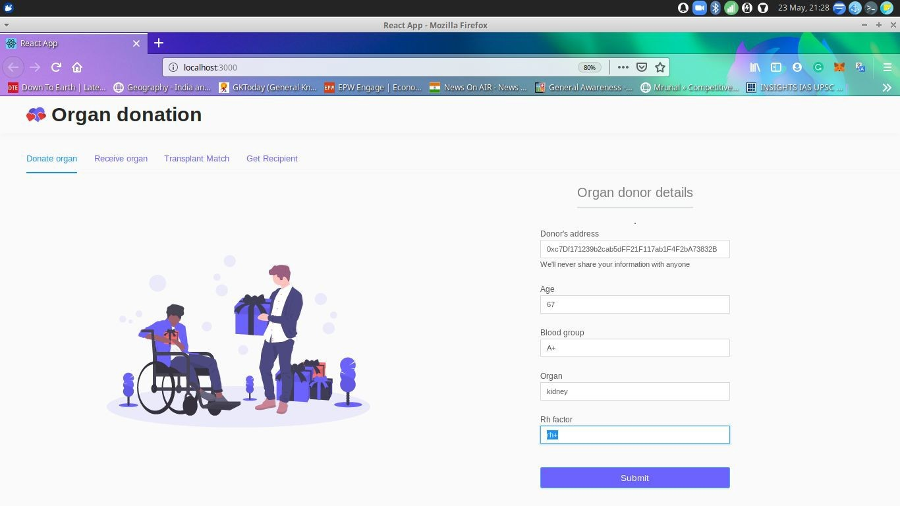
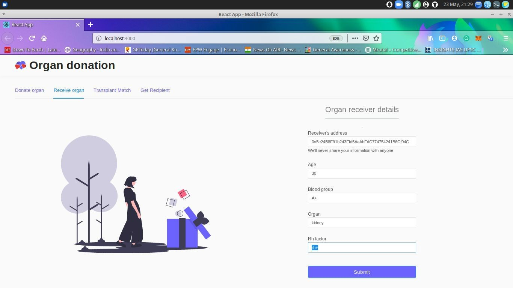
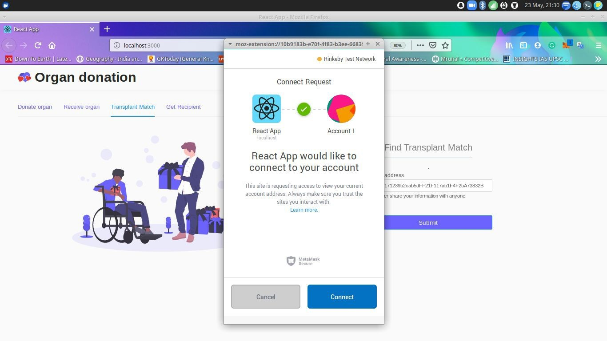
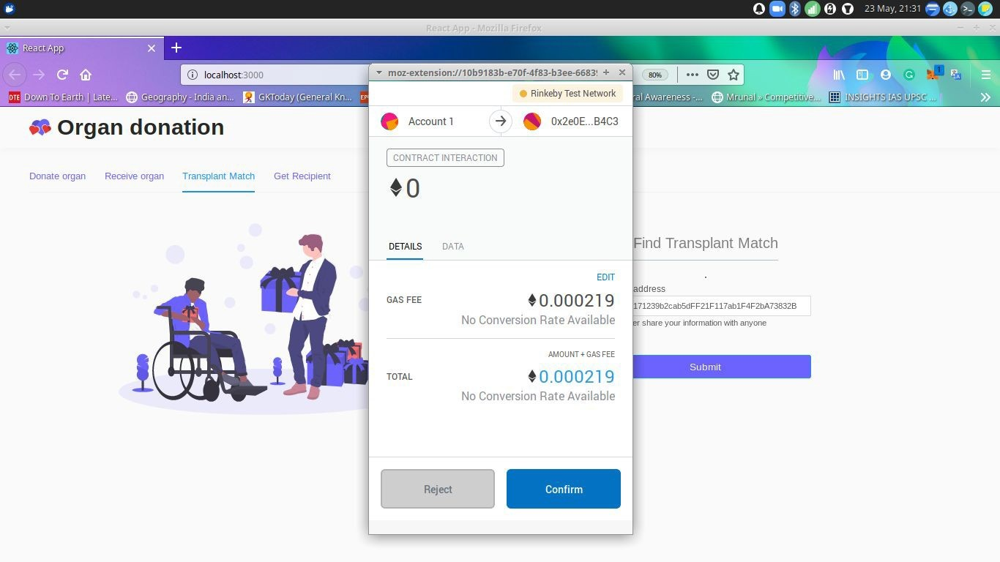
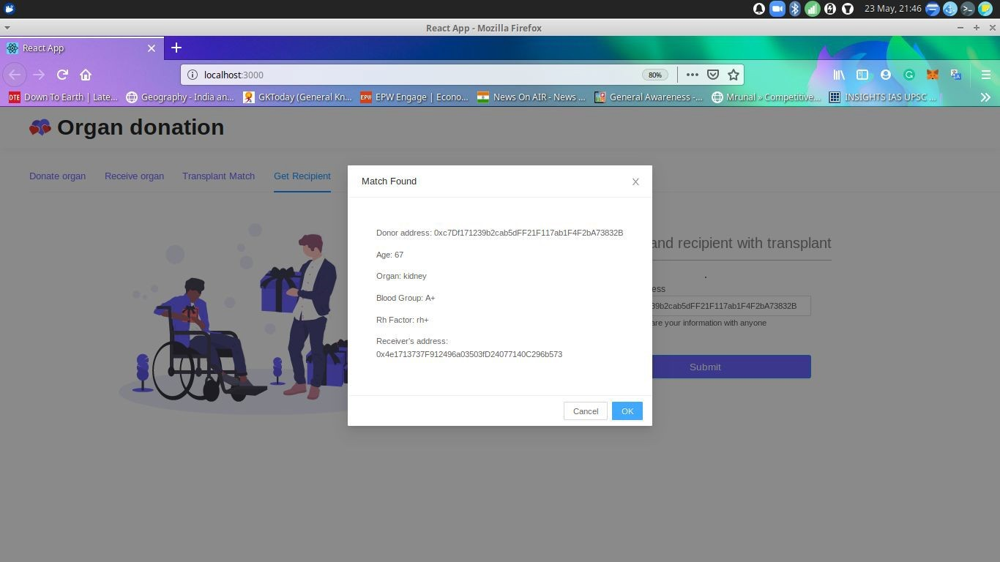

<!DOCTYPE  html PUBLIC "-//W3C//DTD XHTML 1.0 Transitional//EN" "http://www.w3.org/TR/xhtml1/DTD/xhtml1-transitional.dtd">
<html xmlns="http://www.w3.org/1999/xhtml"><head><meta http-equiv="Content-Type" content="text/html; charset=utf-8"/>
 
<body><h1 style="padding-top: 3pt;padding-left: 141pt;text-indent: 0pt;text-align: left;">Donate Life: Blockchain-based Organ Donation Network</h1>
 

Donate Life serves as a platform for people to securely donate their organs and find a match. It is built on Ethereum using solidity language. The accounts of the people concerned can be connected via Metamask and the frontend is built using ReactJS.

 
<ol id="l1"><li>
To run the project, install metamask and create an account.
</li><li>
This will provide an ERC20 address to work with.
</li><li>
In the folder donate-life, open terminal or cd to the folder and enter command: <b>yarn install</b>.
</li><li>
This step will install all the required dependencies stored in the yarn.lock file.
</li><li>
Enter the command: <b>yarn start </b>on the terminal.

This command will prompt to open the browser on the local host and the front-end will be shown.

 

 

</li><li>
To add the Donor details, enter the donor’s metamask address, age, blood group, organ and Rh factor and click the submit button, this will prompt the metamask to open and ask for confirmation. Click on confirm.

</li><li>
Similarly, Recipient details can be added.

</li><li>
To initiate matching, go to Transplant Match tab and enter the donor&#39;s address, to find the matched address add donor’s address in Get Recipient tab.

</li><li>
You’ll see the details of the donor and the matched Recipient’s address.
</li></ol>

</body></html>
